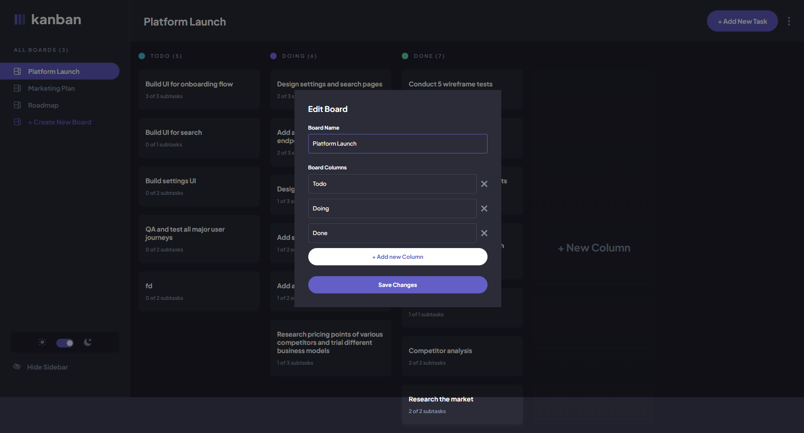
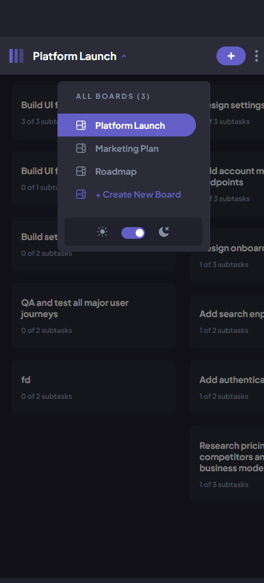
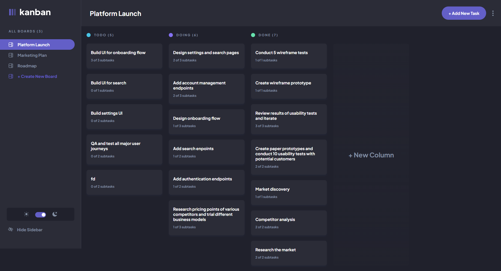

# Frontend Mentor - Kanban task management web app solution

This is a solution to the [Kanban task management web app challenge on Frontend Mentor](https://www.frontendmentor.io/challenges/kanban-task-management-web-app-wgQLt-HlbB). Frontend Mentor challenges help you improve your coding skills by building realistic projects. 

### The challenge

Users should be able to:

- View the optimal layout for the app depending on their device's screen size
- See hover states for all interactive elements on the page
- Create, read, update, and delete boards and tasks
- Receive form validations when trying to create/edit boards and tasks
- Mark subtasks as complete and move tasks between columns
- Hide/show the board sidebar
- Toggle the theme between light/dark modes
- **Bonus**: Allow users to drag and drop tasks to change their status and re-order them in a column
- **Bonus**: Keep track of any changes, even after refreshing the browser (`localStorage` could be used for this if you're not building out a full-stack app)
- **Bonus**: Build this project as a full-stack application

### Screenshot

I present my solution for the Kaban task management challenge. Through careful analysis and thoughtful implementation, I have devised a system that efficiently organizes and tracks tasks, enhancing productivity and promoting effective collaboration. This solution aims to optimize workflow and improve overall project management capabilities.

### Links

- Live Site URL: [Kanban Task Management](https://kanban-task-management-sooty.vercel.app/)

### Built with

- Semantic HTML5 markup
- CSS custom properties
- Sass/SCSS
- CSS Grid
- Mobile-first workflow
- [React](https://reactjs.org/) - JS library
- [React Hook Form](https://react-hook-form.com/) - Performant, flexible and extensible forms with easy-to-use validation.
- [React Bootstrap](https://react-bootstrap.github.io/) - React-Bootstrap replaces the Bootstrap JavaScript. Each component has been built from scratch as a true React component, without unneeded dependencies like jQuery.
- [Typescript](https://www.typescriptlang.org/) - TypeScript is a strongly typed programming language that builds on JavaScript, giving you better tooling at any scale.

## Author

- Website - [Jownsu](https://jownsu.github.io/)
- Frontend Mentor - [@jownsu](https://www.frontendmentor.io/profile/jownsu)
- Instagram - [jownsu](https://www.instagram.com/jownsu/)
- Linked In - [Jhones](https://www.linkedin.com/in/jhones-digno-866904213/)